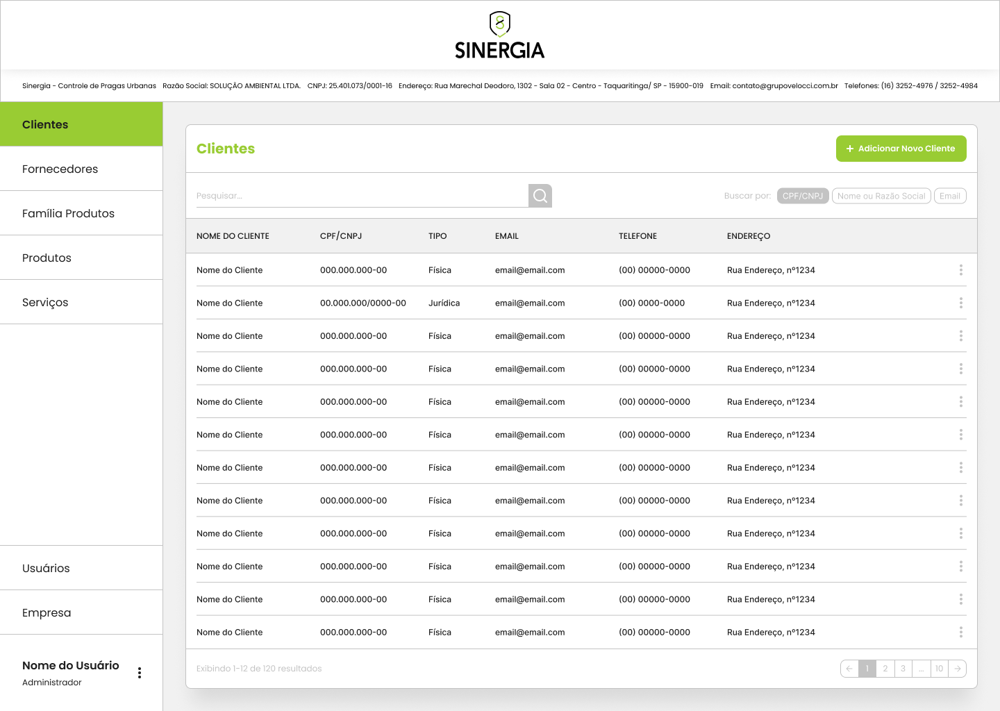

<h1 align=center>Sinergia • Controle de Pragas Urbanas</h1>

Projeto realizado em 2025

<a href="#️-sobre-o-projeto">Sobre</a>&nbsp&nbsp
|&nbsp&nbsp<a href="#-desenvolvimento">Desenvolvimento</a>&nbsp&nbsp|&nbsp&nbsp<a href="#-tecnologias">Tecnologias</a>

    

## 💁‍♂️ Sobre o Projeto
O projeto refere-se à uma empresa fictícia de controle de pragas urbanas, Sinergia. O projeto trabalha a integração de uma API em uma aplicação WEB desenvolvida em React, fazendo o uso do Java para o desenvolvimento do Back-End, e do MongoDB para o banco de dados.

## 📅 Desenvolvimento
O projeto foi realizado entre os meses de Abril e Maio de 2025. Sendo prototipado, inicialmente, no [Figma](https://www.figma.com/community/file/1501413316496898471)

## 🤖 Tecnologias
Esse projeto foi realizado com as seguintes tecnologias:
<ul>
    <li>React</li>
    <li>Tailwind CSS</li>
    <li>JavaScript</li>
    <li>Java</li>
    <li>MongoDB</li>
    <li>Figma</li>
    <li>Git e GitHub</li>
</ul>

___

Desenvolvido por Pietro Pacheco 👤 Redes sociais: <a href="https://linktr.ee/pietropacheco">Linktree</a>
